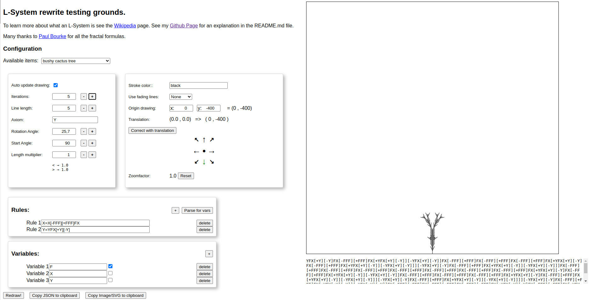

# A GUI to a Lindemaier system to draw curves

This project enables you to experiment with the Lindemaier system to draw curves. This project was generated with [Angular CLI](https://github.com/angular/angular-cli) version 17.3.7.

See [Wikipedia](https://en.wikipedia.org/wiki/L-system) for more information.

# Explanation

An L-system requires a **formula**, **variables** and an **axiom** as the starting formula. Furthermore, a **line length**, **rotation angle**
and **starting angle** must be specified. Sometimes when looking at L-system curve definition on the web, also **constants** are specified.

## The coordinate system

The L-system is drawing curves using the [carthesian coordinates](https://en.wikipedia.org/wiki/Cartesian_coordinate_system). This means that
the X-axis runs from negative values on the left of the screen to positive values on the right of the screen. The Y-axis runs from positive
values at the top of the screen to negative values at the bottom of the screen. See the image below (&copy; Wikimedia)


This is normal for mathematicians but for developers the Y-axis typically runs in the opposite direction and the top-left corner is (0,0) (origin).

## Setting up the coordinate system in SVG

The origin (0,0) is located in the center of the screen. In this website the drawing area is 800x800 pixels. Lines are drawn using the
Scalable Vector Graphics elements (see [MDN](https://developer.mozilla.org/en-US/docs/Web/SVG)).
By using a `transform`-[attribute](https://developer.mozilla.org/en-US/docs/Web/SVG/Attribute/transform) on a `<g>`
[group](https://developer.mozilla.org/en-US/docs/Web/SVG/Element/g) the coordinate-system is changed to the carthesian system:

```svg

<g transform="translate(400,400) scale(1,-1)">...</g>
```

First the origin is moved to (400,400) using the `translate`-[transformation](https://developer.mozilla.org/en-US/docs/Web/SVG/Attribute/transform#translate).
Then the Y-axis is flipped using the `scale`-[transformation](https://developer.mozilla.org/en-US/docs/Web/SVG/Attribute/transform#scale) using
a negative value `-1` to the second value for the Y-axis.

# Formulas

A formula takes the form of:

> `<variable>=<operations> |  <variables>`

Using variables the L-system can be instructed to draw the curve in different parts. An example is:

> `F=F-F+F`

The formula consists of three parts:

1. A letter
2. an equal sign
3. a list of operations and variables

Notice that this seems like a [catch-22 problem](https://nl.wikipedia.org/wiki/Catch-22_(logica): the outcome of the formula is defined using
the same letter: in order to determine `F` you need to calculate a formula using itself.

This is called a recursive formula: the outcome of the formula is used to define itself. So we need some mechanism to stop calculating indefinitely.
We do this using a fixed number of these recursive calculations using "iterations": each iteration calculates the next step.

First we need to look at how to start everything. Because an L-system can consist of multiple formulas.

## Axiom : starting everything

To kick-start the formula we need to define how to start everything. Because if there are multiple formulas, which formula should be used in the
first step?

Let's look at the following L-system:
``` text
X=-YF+XFX+FY-
Y=+XF-YFY-FX+
```

Which formula must be used? To solve this we define the first step as an "axiom".
``` text
axiom = F+F+F
X=-YF+XFX+FY-
Y=+XF-YFY-FX+
```

Now we know how to start the first step (or iteration). 

## Iterations

Now let's have a look at what iterations do. 

Using the formula
> `F=F-F+F`

and axiom
> `F+F+F`

and 3 iterations we get the following formula's for each step. The first iteration is the `axiom`.

1. F+F+F
2. FF-F+F+FF-F+F+FF-F+F
3. FFF-F+F-FF-F+F+FF-F+F+FFF-F+F-FF-F+F+FF-F+F+FFF-F+F-FF-F+F+FF-F+F

As you can see, this quickly grows into something quite large. Therefore, computers are the ideal way to solve these problems.

Now let's look further into these iterations. In a Lindemaier system (L-system) the formula at each iteration is completely parsed and rewritten.
Notice that level 3 is only partly displayed otherwise the image becomes too large.
```text
1:                                  F+F+F
                                    / | \
                                   /  |  \ 
                                  /   |   \
                                 /    |    \
                                /     |     \
2:                           F-F+F  F-F+F  F-F+F  
                             / | \
                            /  |  \ 
                           /   |   \
                          /    |    \
                         /     |     \
3:                    F-F+F  F-F+F  F-F+F
```


## Operations

Operations are typically:

* increase rotation with (fixed) angle : `+`
* decrease rotation with (fixed) angle : `-`
* push state (position+angle) : '['
* pop state (position+angle) : ']'
* increase line length: '<'
* decrease line length: '>'

### Explanation of operations

In L-systems often the curve has **angles**. To change direction after the last line in a different direction, the `rotation angle` is defined
for the complete system. Using the `+` and `-` characters, we instruct the program to change direction in that pre-defined direction.

Sometimes we want to branch off in a certain direction but remember where we started. To save the `state` of system we use a [stack](https://en.wikipedia.org/wiki/Stack_(abstract_data_type).
To save the state use the `[` character. If you want to restore the last known system state, use the ']' system. Note that these characters always
need to come in pairs in *one formula*.

## Variables

When defining the formulas we introduce variables. Often there are two types of variables:
* those who define a formula
* those that draw lines

The variables in the first type often are named `F` and `G`. The letter `F` is chosen because it will draw a *forward* line. Variables that
define formulas are often named `X` and `Y`. However, this is merely convention. On the website of Paul Bourke there is a definition Attributed to Saupe:

```text
axiom = VZFFF
V -> [+++W][---W]YV
W -> +X[-W]Z
X -> -W[+X]Z
Y -> YZ
Z -> [-FFF][+FFF]F
angle = 20&deg;
```

In order to make the program work, it needs to work out which variables are used to actually draw lines. Therefore, there is a list of variables
with a checkmark indicating it will draw a line. Notice the screendump below. In the list of 'Variables' there is a checkmark next to the letter `F`.



After you have entered formulas, use the the button `Parse for vars` to extract the variables and guess which variables should be used for drawing. 

# The program

The program is built using Typescript and Angular. The styling is kept simple to reduce clutter in the HTML for e.g. Angular Material design.

The website has the following functions available:
* Auto update drawing after changing system parameters or number of iterations
* pre-defined positions to start drawing (North, East, South, West, NE, SE, NW, SW)
* Parsing formulas for variables
* Copy system's definition to clipboard
* Copy drawing (SVG) to the clipboard


# Sources for L-systems

* [Wikipedia](https://en.wikipedia.org/wiki/L-system)
* [Paul Bourke](https://paulbourke.net/fractals/lsys/)
* [Gosper fractal explained](https://larryriddle.agnesscott.org/ifs/ksnow/flowsnake.htm)
* [Wikipedia on the Gosper Fractal](https://en.wikipedia.org/wiki/Gosper_curve)
* [Wikipedia on the Peano curve](https://en.wikipedia.org/wiki/Peano_curve)
* [Kerry Mitchell on the Hilbert curve](https://www.kerrymitchellart.com/tutorials/hilbert/hilbert-tutorial.html)
* [Wikipedia on the Hilbert curve](https://en.wikipedia.org/wiki/Hilbert_curve)
* [Wikipedia on Sierpiński curves](https://en.wikipedia.org/wiki/Sierpi%C5%84ski_curve)
* [Wikipedia on Fibonacci Word](https://en.wikipedia.org/wiki/Fibonacci_word)
* [Wikipedia on Fibonacci Word fractal](https://en.wikipedia.org/wiki/Fibonacci_word_fractal)
* [Wikipedia on the canopy (or Tree) fractal](https://en.wikipedia.org/wiki/Fractal_canopy)
* [Wikipedia on the Koch snowflake](https://en.wikipedia.org/wiki/Koch_snowflake)
* [Wikipedia on the Dragon curve](https://en.wikipedia.org/wiki/Dragon_curve)

# Other references

* [Mozilla Development Network - SVG: Scalable Vector Graphics](https://developer.mozilla.org/en-US/docs/Web/SVG)
